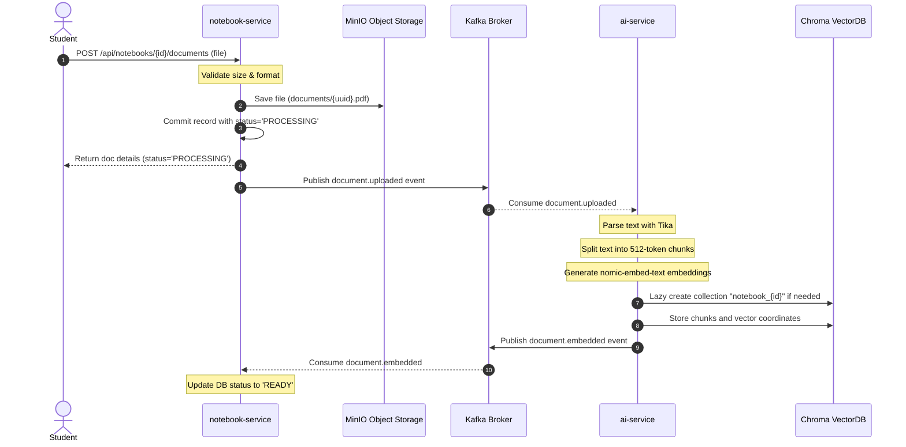
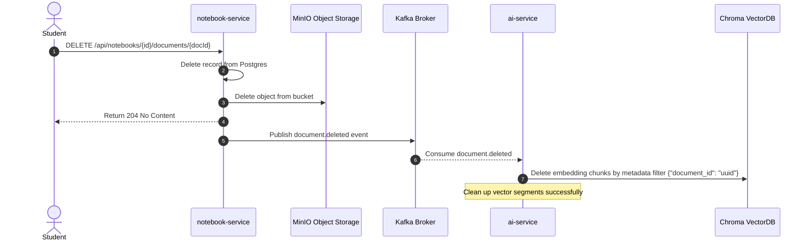
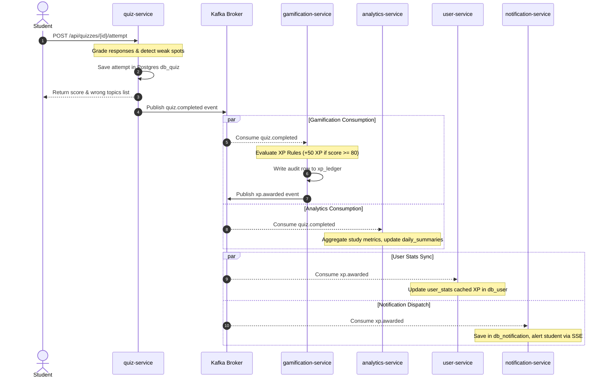
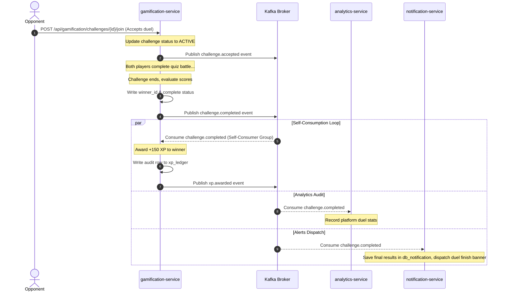

# 📐 Questly — Low-Level Design (LLD)

This document serves as the authoritative technical blueprint for **Questly**, an AI-powered student learning platform. It translates requirements and high-level architecture into precise software designs, data flow patterns, security configurations, and algorithmic models.

---

## 1. Microservice Boundaries & Internal APIs

Questly is structured as a decentralized, polyglot-ready microservice monorepo. It isolates service states, databases, and dependencies.

### 🌐 1.1 Service Catalog and Boundaries

| Service Name | Port | Database | Primary Technology | Responsibility & External Exposure |
| :--- | :--- | :--- | :--- | :--- |
| `gateway` | `8080` | None | Spring Cloud Gateway | Entry point, CORS, RS256 JWT validation, routing |
| `discovery-server` | `8761` | None | Spring Cloud Eureka | Dynamic registration, load balancer service registry |
| `config-server` | `8888` | None | Spring Cloud Config | Centralized configuration repository provider |
| `auth-service` | `8081` | `db_auth` | Spring Boot, Spring Security | Local register/login, Google OAuth2, JWKS endpoint, Refresh token |
| `user-service` | `8082` | `db_user` | Spring Boot | Profile metadata management, cached statistics |
| `notebook-service` | `8083` | `db_notebook` | Spring Boot, MinIO SDK | Document uploads, folder notebook hierarchy, RAG caller |
| `quiz-service` | `8084` | `db_quiz` | Spring Boot | AI quiz generation caller, attempt tracker, weak-spot engine |
| `flashcard-service`| `8085` | `db_flashcard` | Spring Boot | AI flashcard generation caller, SM-2 scheduling engine |
| `course-service` | `8086` | `db_course` | Spring Boot | Curriculum enrollment, drip-unlock module gating |
| `assignment-service`| `8087`| `db_assignment` | Spring Boot | Assignment submissions, AI auto-grading orchestrator |
| `practice-service` | `8088` | `db_practice` | Spring Boot | LeetCode list tracker, solving status tracking |
| `gamification-service`| `8090`| `db_gamification` | Spring Boot | XP rules ledger, badge awards, skill-tree DAG, duel challenges |
| `analytics-service`| `8091` | `db_analytics` | Spring Boot | **Pure consumer**. Aggregates study activity metrics |
| `notification-service`| `8092`| `db_notification` | Spring Boot | **Pure consumer**. Dispatches alerts and in-app updates |
| `ai-service` | `8089` | ChromaDB | Spring Boot, LangChain4j | **Internal-only**. Document embedding, parsing, RAG query, AI generation |

*Statelessness Note*: `gateway`, `discovery-server`, and `config-server` are 100% stateless infrastructure components. They require no database schemas, no local storage volumes, and scale horizontally without coordination.

---

### 🔒 1.2 `ai-service` Internal-Only REST Boundary

The `ai-service` is highly resource-intensive and encapsulated. It is **denied** access from the outside world via the Spring Cloud Gateway. It communicates synchronously using HTTP REST with upstream backend services.

```
                     ┌──────────────────┐
                     │    API Gateway   │
                     └────────┬─────────┘
                              │ (Denies /internal/**)
                              ▼
   ┌───────────────────────────────────────────────────────────┐
   │                  REST Orchestrations                      │
   └──────────┬──────────────┬───────────────┬─────────────┬───┘
              │              │               │             │
              ▼              ▼               ▼             ▼
      ┌──────────────┐┌──────────────┐┌──────────────┐┌──────────────┐
      │  notebook-   ││     quiz-    ││  flashcard-  ││  assignment- │
      │   service    ││    service   ││    service   ││    service   │
      └───────┬──────┘└──────┬───────┘└──────┬───────┘└──────┬───────┘
              │              │               │               │
              │ (Synchronous Internal HTTP REST Calls)       │
              └──────────────┼───────────────┼───────────────┘
                             ▼
                     ┌──────────────┐
                     │  ai-service  │
                     └──────────────┘
```

#### REST Contract Specifications:

##### 1. `POST /internal/v1/ai/embed`
- **Called by**: `notebook-service` (on receiving `document.uploaded` signal or sync process)
- **Request Body**:
  ```json
  {
    "documentId": "uuid",
    "notebookId": "uuid",
    "minioPath": "documents/raw-file.pdf",
    "format": "PDF"
  }
  ```
- **Response**:
  ```json
  {
    "status": "COMPLETED",
    "chunkCount": 42,
    "collectionId": "notebook_{notebookId}"
  }
  ```

##### 2. `POST /internal/v1/ai/query`
- **Called by**: `notebook-service` (for grounding Q&A query)
- **Request Body**:
  ```json
  {
    "notebookId": "uuid",
    "question": "What is self-attention?"
  }
  ```
- **Response**:
  ```json
  {
    "answer": "Self-attention correlates different positions of a single sequence...",
    "sources": [
      {
        "documentId": "uuid",
        "sourceName": "attention_paper.pdf",
        "chunk": "We propose a new model architecture, the Transformer, relying entirely on self-attention..."
      }
    ]
  }
  ```

##### 3. `POST /internal/v1/ai/generate/quiz`
- **Called by**: `quiz-service`
- **Request Body**:
  ```json
  {
    "notebookId": "uuid",
    "count": 5,
    "types": ["MCQ", "FILL", "SHORT"]
  }
  ```
- **Response**:
  ```json
  {
    "questions": [
      {
        "type": "MCQ",
        "question": "Which architecture relies solely on attention mechanisms?",
        "options": ["RNN", "CNN", "Transformer", "LSTM"],
        "answer": "Transformer",
        "topic": "Transformer Architecture"
      }
    ]
  }
  ```

##### 4. `POST /internal/v1/ai/generate/flashcards`
- **Called by**: `flashcard-service`
- **Request Body**:
  ```json
  {
    "notebookId": "uuid",
    "count": 10
  }
  ```
- **Response**:
  ```json
  {
    "flashcards": [
      {
        "question": "What is the primary role of the Encoder in a Transformer?",
        "answer": "To map an input sequence of symbol representations to a sequence of continuous representations."
      }
    ]
  }
  ```

##### 5. `POST /internal/v1/ai/summarize`
- **Called by**: `notebook-service`
- **Request Body**:
  ```json
  {
    "minioPath": "documents/chapter1.pdf",
    "format": "PDF"
  }
  ```
- **Response**:
  ```json
  {
    "summary": "This document outlines the foundation of deep learning attention layers..."
  }
  ```

##### 6. `POST /internal/v1/ai/grade`
- **Called by**: `assignment-service`
- **Request Body**:
  ```json
  {
    "submissionContent": "...",
    "rubric": "Grade out of 100 based on completeness, syntax, and accuracy..."
  }
  ```
- **Response**:
  ```json
  {
    "score": 90.5,
    "feedback": "Excellent structured answer, though missing detailed computational constraints."
  }
  ```

---

## 2. Pure Consumer Services

`analytics-service` and `notification-service` are strictly asynchronous, event-driven components. 

> [!IMPORTANT]
> To prevent architectural coupling, **neither** of these services exposes inbound REST endpoints for other internal microservices. They assemble state exclusively by subscribing to Kafka event topics.

### 📊 2.1 Analytics Service (`analytics-service`)
- **State**: Accumulates hourly/daily metrics for tracking student work trends, scores, and time-on-topic.
- **REST Exposure**: Only exposes outbound endpoints to the public frontend gateway (`/api/analytics/**`) to populate student charts.
- **Inbound Calls**: **Zero**. Other microservices must never call this service directly.

### 🔔 2.2 Notification Service (`notification-service`)
- **State**: Stores simple push/pull notifications in `db_notification` for audit tracking.
- **REST Exposure**: Only exposes read/patch status endpoints to the public frontend gateway (`/api/notifications/**`).
- **Inbound Calls**: **Zero**. All dynamic trigger notifications are generated asynchronously via Kafka event brokers.

---

## 3. Security & Identity Management

Questly secures edge routing and services with an asymmetric **RS256 JWT** authentication model combined with **Google OAuth2** federated login.

```
┌──────┐          ┌──────────────┐          ┌──────────────┐          ┌──────────────────┐
│ User │          │   gateway    │          │ auth-service │          │   user-service   │
└──┬───┘          └──────┬───────┘          └──────┬───────┘          └────────┬─────────┘
   │                     │                         │                           │
   │ 1. POST /login      │                         │                           │
   ├────────────────────>│────────────────────────>│                           │
   │                     │                         │                           │
   │ 2. Return Tokens    │                         │                           │
   │    (RS256 signed)   │                         │                           │
   │<────────────────────│<────────────────────────┤                           │
   │                     │                         │                           │
   │ 3. Fetch JWKS keys  │                         │                           │
   │    (once/cached)    │                         │                           │
   │                     ├────────────────────────>│                           │
   │                     │<────────────────────────┤                           │
   │                     │                         │                           │
   │ 4. Request /users/me│                         │                           │
   │    with Bearer Token│                         │                           │
   ├────────────────────>│                         │                           │
   │                     │ [Validates Signature]   │                           │
   │                     │ [Injects X-User-Id]     │                           │
   │                     ├─────────────────────────┼──────────────────────────>│
   │                     │                         │                           │
```

---

### 🔑 3.1 Asymmetric RS256 JWT Authentication & JWKS

1. **Token Generation (`auth-service`)**:
   - On a successful local password verification or Google OAuth2 callback, `auth-service` signs a JWT token using an asymmetric **Private RSA Key** (stored securely in Spring Cloud Config server).
   - Token payload claims:
     ```json
     {
       "sub": "3f82cb50-d5be-45a1-a675-ea224976722d",
       "email": "student@questly.edu",
       "role": "STUDENT",
       "iss": "questly-auth",
       "exp": 1779951600
     }
     ```
2. **Dynamic JWKS Endpoint**:
   - `auth-service` exposes public credentials dynamically at: `GET /api/auth/.well-known/jwks.json`
   - Yields the RSA Public Key exponent and modulus parameters safely:
     ```json
     {
       "keys": [
         {
           "kty": "RSA",
           "use": "sig",
           "alg": "RS256",
           "kid": "questly-key-id",
           "n": "u1W3b...[modulus]",
           "e": "AQAB"
         }
       ]
     }
     ```
3. **Gateway Signature Validation**:
   - The `gateway` intercepts all inbound resource requests. It is configured with a Spring Security `ReactiveJwtDecoder` pointing directly to the JWKS endpoint:
     ```yaml
     spring:
       security:
         oauth2:
           resourceserver:
             jwt:
               jwk-set-uri: http://auth-service:8081/api/auth/.well-known/jwks.json
     ```
   - The Gateway dynamically caches these public keys. When an HTTP request carries a `Authorization: Bearer <token>` header, the gateway validates the signature using the cached public key *without* calling the downstream `auth-service`.
   - **Header Propagation Filter**: Once validated, the Gateway extracts `sub` and `role` and forwards them to downstream microservices using custom HTTP headers:
     - `X-User-Id`
     - `X-User-Role`

---

### 🌐 3.2 Google OAuth2 Login Sequence

Questly supports seamless Google Single Sign-On (SSO):

```
┌──────┐          ┌──────────┐          ┌──────────────┐          ┌──────────────┐          ┌────────┐
│ User │          │ gateway  │          │ auth-service │          │ user-service │          │ Google │
└──┬───┘          └────┬─────┘          └──────┬───────┘          └──────┬───────┘          └───┬────┘
   │                   │                       │                         │                      │
   │ 1. GET /oauth2/google                     │                         │                      │
   ├──────────────────>│──────────────────────>│                                                │
   │ 2. Redirect to Google Auth Page           │                                                │
   │<──────────────────│<──────────────────────┤                                                │
   │                                           │                                                │
   │ 3. Authenticates & Grants Consent         │                                                │
   ├───────────────────────────────────────────┼───────────────────────────────────────────────>│
   │ 4. Callback /oauth2/callback?code=xxx     │                                                │
   ├──────────────────>│──────────────────────>├───────────────────────────────────────────────>│
   │                                           │ [Exchanges auth-code for Profile Details]      │
   │                                           │                                                │
   │                                           │ 5. user.registered Event (Kafka)               │
   │                                           ├─────────────────────────┬─────────────────────>│
   │                                           │                         │                      │
   │                                           │                         ▼                      │
   │                                           │                  [Creates Profile]             │
   │ 6. Redirect back to UI with JWT Tokens    │                                                │
   │<──────────────────│<──────────────────────┤                                                │
```

1. **Callback & Identity Mapping**:
   - Google returns profile details (`sub`, `email`, `name`, `picture`).
   - If the `email` does not exist in `db_auth.users`:
     - Creates a user record with `provider='GOOGLE'`, `provider_id=sub`, and generating a random UUID as the internal `userId`.
     - Publishes a `user.registered` event payload to Kafka containing the internal `userId`, `email`, `name`, and `picture` url.
   - If the email *does* exist, updates `provider_id` (if changing authentication method) and retrieves the existing `userId`.
2. **Token Issuance**:
   - Generates a local access JWT and refresh token using the internal `userId`, redirecting the student back to the frontend dashboard.

---

## 4. API Gateway & Discovery Routing

Spring Cloud Gateway acts as the secure, load-balanced entry boundary. It discovers routing coordinates from Eureka registry dynamically.

### 🌐 4.1 Gateway Routing Configuration (`application.yml`)

```yaml
spring:
  cloud:
    gateway:
      discovery:
        locator:
          enabled: true
          lower-case-service-name: true
      routes:
        - id: auth-service
          uri: lb://auth-service
          predicates:
            - Path=/api/auth/**
          filters:
            - StripPrefix=0
            
        - id: user-service
          uri: lb://user-service
          predicates:
            - Path=/api/users/**
          filters:
            - StripPrefix=0

        - id: notebook-service
          uri: lb://notebook-service
          predicates:
            - Path=/api/notebooks/**
          filters:
            - StripPrefix=0

        - id: quiz-service
          uri: lb://quiz-service
          predicates:
            - Path=/api/quizzes/**
          filters:
            - StripPrefix=0

        - id: flashcard-service
          uri: lb://flashcard-service
          predicates:
            - Path=/api/flashcards/**
          filters:
            - StripPrefix=0

        - id: course-service
          uri: lb://course-service
          predicates:
            - Path=/api/courses/**
          filters:
            - StripPrefix=0

        - id: assignment-service
          uri: lb://assignment-service
          predicates:
            - Path=/api/assignments/**
          filters:
            - StripPrefix=0

        - id: practice-service
          uri: lb://practice-service
          predicates:
            - Path=/api/practice/**
          filters:
            - StripPrefix=0

        - id: gamification-service
          uri: lb://gamification-service
          predicates:
            - Path=/api/gamification/**
          filters:
            - StripPrefix=0

        - id: analytics-service
          uri: lb://analytics-service
          predicates:
            - Path=/api/analytics/**
          filters:
            - StripPrefix=0

        - id: notification-service
          uri: lb://notification-service
          predicates:
            - Path=/api/notifications/**
          filters:
            - StripPrefix=0
```

### 🛰️ 4.2 Security Gating Filter Rules
- **Internal Paths Gating**: Global filter blocks any dynamic mapping paths containing `/internal/**`. This ensures `/internal/v1/ai/**` can only be routed from within the private Kubernetes namespace or local network loop.
- **Gateway Filters**: Enforces a default global rate limiter based on the sliding-window algorithm backed by Redis.

---

## 5. Local RAG Pipeline & ChromaDB Lifecycle

Questly uses a fully isolated, offline RAG pipeline utilizing local Ollama execution and LangChain4j abstractions.

```
       [ raw document ]
              │
              ▼ (Apache Tika Text Extractor)
         [ raw text ]
              │
              ▼ (LangChain4j Document Splitter: 512 tokens / 64 overlap)
         [ chunks ]
              │
              ▼ (nomic-embed-text via Ollama)
        [ embeddings ]
              │
              ▼ (ChromaDB API V2 client)
   [ Collection: notebook_{id} ]
```

---

### 📂 5.1 Document Ingestion Flow
1. **Extraction**: `ai-service` receives document path, reads raw stream from MinIO, and parses file content using **Apache Tika** to extract clean string buffers.
2. **Chunking**: Uses LangChain4j's `DocumentSplitters.recursive(512, 64, new GptBytePairEncoder())` to ensure semantic chunks are partitioned with overlaps to preserve contextual transitions.
3. **Embeddings Generation**: Chunks are processed in batches via Ollama API mapping `nomic-embed-text` (producing 768-dimension coordinate arrays).
4. **Isolated Vector Storage**:
   - Collections are partitioned per-notebook using naming schema: `notebook_{notebook_id}`.
   - **Strict Lazy Collection Lifecycle**: Collections are not created on empty notebook creation. Instead, the collection is instantiated strictly on the successful processing of the first document upload payload.
   - **Chroma API Setup**:
     ```java
     ChromaEmbeddingStore store = ChromaEmbeddingStore.builder()
         .apiVersion(ChromaApiVersion.V2)
         .baseUrl("http://localhost:8000")
         .collectionName("notebook_" + notebookId)
         .build();
     ```

---

### 🔍 5.2 Retrieval & Grounded Query Execution
1. **Inquiry Validation**: When executing a query, `ai-service` runs a defensive fallback check. If the ChromaDB collection `notebook_{notebookId}` does not exist (e.g., student notebook has no files uploaded), it returns a standard grounded error response immediately without reaching out to Ollama: *"Please upload study documents to this notebook first."*
2. **Context Compilation**:
   - Embeds user input question using `nomic-embed-text`.
   - Executes similarity match query using cosine distance metrics to capture the **top 5** chunks.
   - Context is injected directly into a structured, strict LLM system instructions boundary block.
3. **Prompt Template**:
   ```
   You are Questly, an expert student learning tutor.
   Answer the student's question based strictly on the source documents provided below.
   If the answer cannot be found in the provided sources, state: "I cannot find the answer in your uploaded documents."
   Do not make up facts.
   
   ---
   SOURCE CHUNKS:
   [1] {Source Name: document1.pdf, Content: ...}
   [2] {Source Name: lecture2.txt, Content: ...}
   
   ---
   STUDENT QUESTION:
   {question}
   ```
4. **Generation**: `llama3.2:3b` generates the grounded answer.

---

## 6. Core Algorithmic Specs

Questly handles card learning schedules, prerequisite node locks, and XP ledger tracking using standardized algorithms.

### 🗂️ 6.1 SM-2 Spaced Repetition Logic

To calculate a student's optimal card review cycle, Questly implements the classic SM-2 scheduling algorithm.

#### 1. Input Parameters:
- $q$: User response score rating ($0 \le q \le 5$):
  - `Again` = $0$ (Blackout / Forgot)
  - `Hard` = $2$ (Incorrect, but easily remembered once shown)
  - `Good` = $4$ (Correct, with some hesitation)
  - `Easy` = $5$ (Perfect response, zero delay)
- $n$: Repetitions count (consecutive successful runs)
- $EF$: Ease Factor (starting default: $2.50$)
- $I$: Interval in days (starting default: $1$)

#### 2. Recalculation Engine:
- **If rating is poor ($q < 3$)**:
  - Reset consecutive repetitions: $n = 0$
  - Reset interval: $I = 1$
  - Ease Factor ($EF$) remains unchanged.
- **If rating is correct ($q \ge 3$)**:
  - Calculate next repetition count: $n = n + 1$
  - Calculate next Interval $I$:
    - For $n = 1$: $I = 1$
    - For $n = 2$: $I = 6$
    - For $n > 2$: $I = \text{round}(I_{\text{previous}} \times EF)$
  - Adjust Ease Factor $EF$:
    $$EF = EF + (0.1 - (5 - q) \times (0.08 + (5 - q) \times 0.02))$$
    *Bound Constraint*: If calculated $EF < 1.30$, clamp $EF = 1.30$.

---

### 🌳 6.2 Skill Tree Unlock Logic (Prerequisite DAG)

The skill tree is structured as a **Directed Acyclic Graph (DAG)**.

```
       [ Node A (Locked) ]
             ▲     ▲
      (Prereq)     (Prereq)
             │     │
      [ Node B ]  [ Node C ]
```

#### Graph Definition:
- Each node $N$ possesses a collection of prerequisite UUIDs: $\text{prerequisites}(N) = \{P_1, P_2, \dots, P_k\}$
- Completed Nodes Set for user $U$: $C_U = \{N_x \in \text{SkillTreeNodes} \mid \text{user\_skill\_progress.completed} = \text{true}\}$

#### DAG Node Unlock Rule:
A node $N$ transitions from `unlocked = false` to `unlocked = true` for user $U$ if and only if all its prerequisite nodes are members of the user's completed set:
$$\text{prerequisites}(N) \subseteq C_U$$

#### DAG Traversal Verification:
1. **Asynchronous Check**: When a user completes a node activity (e.g. passing a quiz or finishing a module), a `module.completed` or `quiz.completed` event is broadcasted.
2. **Re-Evaluation**: `gamification-service` fetches the set $C_U$ of completed nodes.
3. **Unlock Propagation**:
   - Queries all adjacent target nodes where the completed node was a prerequisite.
   - For each target node, checks the subset unlock rule $\text{prerequisites}(N) \subseteq C_U$.
   - If satisfied, writes an unlock record to `user_skill_progress` and publishes a `notification.dispatch` request for the student.

---

### 🏆 6.3 XP Rules Engine & Ledger Audit

To maintain strict data integrity and prevent gamification hacking, XP totals are audited using double-entry ledger bookkeeping.

| Source Event | Criteria | XP Awarded |
| :--- | :--- | :--- |
| `QUIZ_COMPLETED` | Score $\ge 80.0\%$ | +50 XP |
| `QUIZ_COMPLETED` | Score $\ge 50.0\%$ and $<80.0\%$ | +30 XP |
| `FLASHCARD_REVIEWED`| Rated `Good (4)` or `Easy (5)` | +10 XP |
| `MODULE_COMPLETED` | Module course progression unlock | +100 XP |
| `PRACTICE_SOLVED` | Problem marked `SOLVED` | +40 XP |
| `CHALLENGE_WON` | Defeated opponent in quiz battle | +150 XP |

#### Bookkeeping Design:
1. **Source of Truth**: All XP increases are committed as immutable rows to `db_gamification.xp_ledger`.
2. **Materialized View**: `db_user.user_stats.xp` is a materialized sum. It is updated asynchronously when the `gamification-service` evaluates a ledger entry and broadcasts a `xp.awarded` Kafka event. If discrepancies are suspected, a reconciliation job sums the ledger entries to overwrite the cache.

---

## 7. Redis Caching Strategy

Questly uses a high-performance Redis container to cache transient user statistics, streak counters, and live duel states.

| Cache Namespace | Key Format | Data Structure | TTL | Eviction / Invalidation Policy |
| :--- | :--- | :--- | :--- | :--- |
| `user:profile` | `user:profile:{userId}` | Hash | 1 Hour | Invalidated on profile update (`PUT /api/users/me`) |
| `user:stats` | `user:stats:{userId}` | Hash | 24 Hours | Invalidated on any score/review/solving Kafka event |
| `user:streak` | `user:streak:{userId}` | String | 48 Hours | Incremented on daily active event |
| `gamification:leaderboard` | `leaderboard:global` | Sorted Set (ZSET) | 15 Mins | Periodically recalculated from database ledger |
| `challenge:match` | `challenge:{challengeId}` | Hash | 30 Mins | Purged automatically on match completion event |

---

## 8. Kafka Event Choreography Flows

Questly relies on Kafka event choreography to handle complex asynchronous operations, decoupled notifications, and analytics pipelines.

### 🖼️ 8.1 Core Choreography Diagrams

#### Ingestion & Vector Embedding Workflow:



#### Vector Purging Workflow (Document Deletion):



#### Gamification & Analytics Workflow:



#### Challenge Self-Consumption Workflow:


