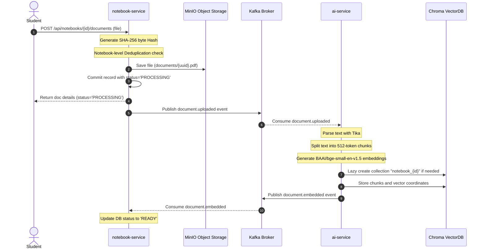
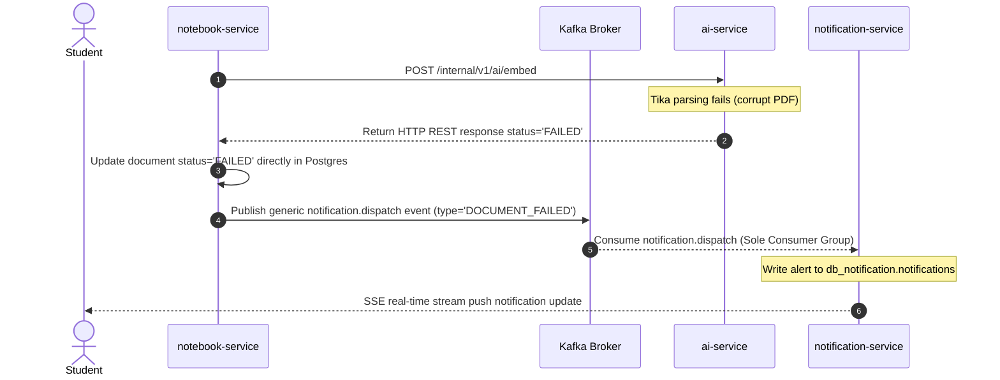
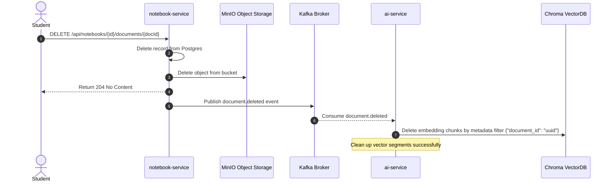
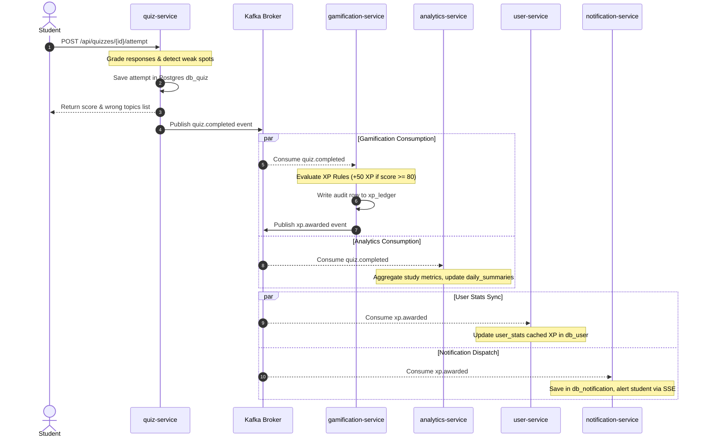
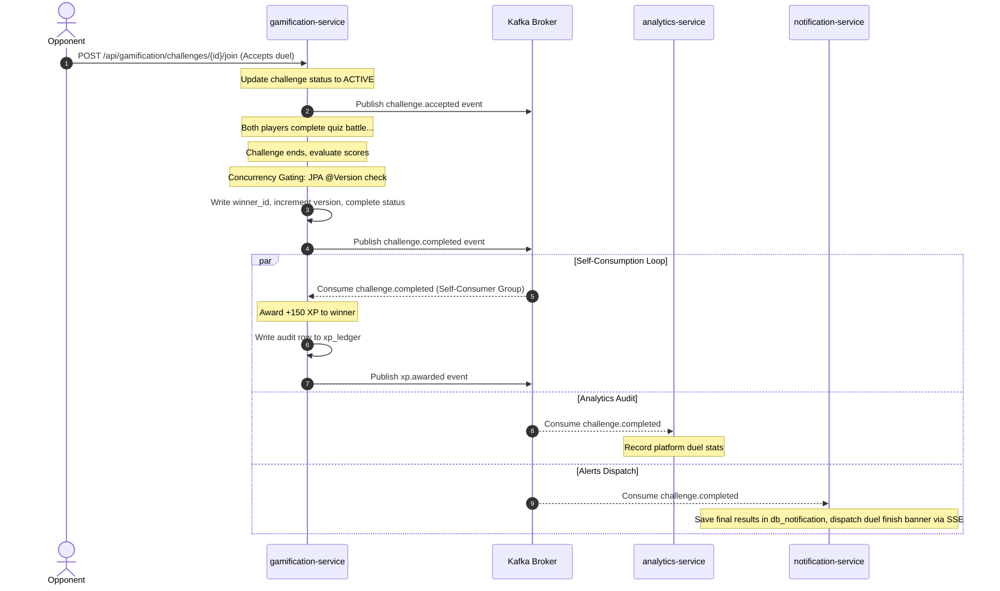

# 📐 Questly — Low-Level Design (LLD)

This document serves as the authoritative technical blueprint for **Questly**, an AI-powered student learning platform. It translates requirements and high-level architecture into precise software designs, data flow patterns, security configurations, and algorithmic models.

---

## 1. Microservice Boundaries & Internal APIs

Questly is structured as a decentralized, polyglot-ready microservice monorepo. It isolates service states, databases, and dependencies.

### 🌐 1.1 Service Catalog and Boundaries

| Service Name | Port | Database | Primary Technology | Responsibility & External Exposure |
| :--- | :--- | :--- | :--- | :--- |
| `gateway` | `8080` | None | Spring Cloud Gateway | Entry point, CORS, RS256 JWT validation, routing, token masking |
| `discovery-server` | `8761` | None | Spring Cloud Eureka | Dynamic registration, load balancer service registry |
| `config-server` | `8888` | None | Spring Cloud Config | Centralized configuration repository provider |
| `auth-service` | `8081` | `db_auth` | Spring Boot, Spring Security | Local register/login, Google OAuth2, JWKS endpoint, Refresh token |
| `user-service` | `8082` | `db_user` | Spring Boot | Profile metadata management, cached statistics |
| `notebook-service` | `8083` | `db_notebook` | Spring Boot, MinIO SDK | Document uploads, folder notebook hierarchy, RAG caller, Drive sync |
| `quiz-service` | `8084` | `db_quiz` | Spring Boot | AI quiz generation caller, attempt tracker, weak-spot engine |
| `flashcard-service`| `8085` | `db_flashcard` | Spring Boot | AI flashcard generation caller, SM-2 scheduling engine |
| `course-service` | `8086` | `db_course` | Spring Boot | Curriculum enrollment, drip-unlock module gating |
| `assignment-service`| `8087`| `db_assignment` | Spring Boot | Assignment submissions, AI auto-grading orchestrator, event-driven loops |
| `practice-service` | `8088` | `db_practice` | Spring Boot | LeetCode list tracker, solving status tracking |
| `gamification-service`| `8090`| `db_gamification` | Spring Boot | XP rules ledger, badge awards, skill-tree DAG, duel challenges |
| `analytics-service`| `8091` | `db_analytics` | Spring Boot | **Pure consumer**. Aggregates study activity metrics |
| `notification-service`| `8092`| `db_notification` | Spring Boot, WebFlux | **Pure consumer**. Dispatches real-time SSE updates |
| `ai-service` | `8089` | ChromaDB | Spring Boot, LangChain4j | **Internal-only**. Document embedding, parsing, RAG query, AI generation |

*Statelessness Note*: `gateway`, `discovery-server`, and `config-server` are 100% stateless infrastructure components. They require no database schemas, no local storage volumes, and scale horizontally without coordination.

---

### 🔒 1.2 `ai-service` Internal-Only REST Boundary

The `ai-service` is highly resource-intensive and encapsulated. It is **denied** access from the outside world via the Spring Cloud Gateway. It communicates synchronously using HTTP REST with upstream backend services.

```
                     ┌──────────────────┐
                     │    API Gateway   │
                     └────────┬─────────┘
                              │ (Denies /internal/**)
                              ▼
   ┌───────────────────────────────────────────────────────────┐
   │                  REST Orchestrations                      │
   └──────────┬──────────────┬───────────────┬─────────────┬───┘
              │              │               │             │
              ▼              ▼               ▼             ▼
      ┌──────────────┐┌──────────────┐┌──────────────┐┌──────────────┐
      │  notebook-   ││     quiz-    ││  flashcard-  ││  assignment- │
      │   service    ││    service   ││    service   ││    service   │
      └───────┬──────┘└──────┬───────┘└──────┬───────┘└──────┬───────┘
              │              │               │               │
              │ (Synchronous Internal HTTP REST Calls)       │
              └──────────────┼───────────────┼───────────────┘
                             ▼
                     ┌──────────────┐
                     │  ai-service  │
                     └──────────────┘
```

#### REST Contract Specifications:

##### 1. `POST /internal/v1/ai/embed`
- **Called by**: `notebook-service` (on receiving `document.uploaded` signal or sync process)
- **Request Body**:
  ```json
  {
    "documentId": "uuid",
    "notebookId": "uuid",
    "minioPath": "documents/raw-file.pdf",
    "format": "PDF"
  }
  ```
- **Response**:
  ```json
  {
    "status": "COMPLETED",
    "chunkCount": 42,
    "collectionId": "notebook_{notebookId}"
  }
  ```

##### 2. `POST /internal/v1/ai/query`
- **Called by**: `notebook-service` (for grounding Q&A query)
- **Request Body**:
  ```json
  {
    "notebookId": "uuid",
    "question": "What is self-attention?"
  }
  ```
- **Response**:
  ```json
  {
    "answer": "Self-attention correlates different positions of a single sequence...",
    "sources": [
      {
        "documentId": "uuid",
        "sourceName": "attention_paper.pdf",
        "chunk": "We propose a new model architecture, the Transformer, relying entirely on self-attention..."
      }
    ]
  }
  ```

##### 3. `POST /internal/v1/ai/generate/quiz`
- **Called by**: `quiz-service`
- **Request Body**:
  ```json
  {
    "notebookId": "uuid",
    "count": 5,
    "types": ["MCQ", "FILL", "SHORT"]
  }
  ```
- **Response**:
  ```json
  {
    "questions": [
      {
        "type": "MCQ",
        "question": "Which architecture relies solely on attention mechanisms?",
        "options": ["RNN", "CNN", "Transformer", "LSTM"],
        "answer": "Transformer",
        "topic": "Transformer Architecture"
      }
    ]
  }
  ```

##### 4. `POST /internal/v1/ai/generate/flashcards`
- **Called by**: `flashcard-service`
- **Request Body**:
  ```json
  {
    "notebookId": "uuid",
    "count": 10
  }
  ```
- **Response**:
  ```json
  {
    "flashcards": [
      {
        "question": "What is the primary role of the Encoder in a Transformer?",
        "answer": "To map an input sequence of symbol representations to a sequence of continuous representations."
      }
    ]
  }
  ```

##### 5. `POST /internal/v1/ai/summarize`
- **Called by**: `notebook-service`
- **Request Body**:
  ```json
  {
    "minioPath": "documents/chapter1.pdf",
    "format": "PDF"
  }
  ```
- **Response**:
  ```json
  {
    "summary": "This document outlines the foundation of deep learning attention layers..."
  }
  ```

##### 6. `POST /internal/v1/ai/grade`
- **Called by**: `assignment-service`
- **Request Body**:
  ```json
  {
    "submissionContent": "...",
    "rubric": "Grade out of 100 based on completeness, syntax, and accuracy..."
  }
  ```
- **Response**:
  ```json
  {
    "score": 90.5,
    "feedback": "Excellent structured answer, though missing detailed computational constraints."
  }
  ```

---

## 2. Pure Consumer Services

`analytics-service` and `notification-service` are strictly asynchronous, event-driven components. 

> [!IMPORTANT]
> To prevent architectural coupling, **neither** of these services exposes inbound REST endpoints for other internal microservices. They assemble state exclusively by subscribing to Kafka event topics.

### 📊 2.1 Analytics Service (`analytics-service`)
- **State**: Accumulates hourly/daily metrics for tracking student work trends, scores, and time-on-topic.
- **REST Exposure**: Only exposes outbound endpoints to the public frontend gateway (`/api/analytics/**`) to populate student charts.
- **Inbound Calls**: **Zero**. Other microservices must never call this service directly.

### 🔔 2.2 Notification Service (`notification-service`)
- **State**: Stores simple push/pull notifications in `db_notification` for audit tracking.
- **REST Exposure**: Only exposes read/patch status endpoints to the public frontend gateway (`/api/notifications/**`), plus one real-time SSE stream endpoint.
- **Inbound Calls**: **Zero**. All dynamic trigger notifications are generated asynchronously via Kafka event brokers.

#### 📡 2.2.1 Real-Time Server-Sent Events (SSE) Push Delivery
To satisfy the requirements of immediate feedback (visible within 30 seconds for grading, 5 seconds for analytics), the `notification-service` establishes a stateless Server-Sent Events (SSE) real-time pipeline.

```
                  ┌──────────────────┐
                  │  Active Browser  │
                  └────────┬─────────┘
                           │ (Persistent SSE Connection: GET /api/notifications/stream)
                           ▼
                  ┌──────────────────┐
                  │     gateway      │
                  └────────┬─────────┘
                           │ (Dynamic Route Propagation)
                           ▼
                  ┌──────────────────┐
                  │notification-svc  │
                  └────────┬─────────┘
                           │ (Subscribes to redis channel user:notifications:{userId})
                           ▼
                  ┌──────────────────┐
                  │  Redis Broker    │
                  └──────────────────┘
```

1. **Client Stream Gating**:
   - The frontend browser opens a persistent SSE connection at `GET /api/notifications/stream`.
   - The request contains standard Bearer authorization headers validated by the Gateway (which propagates `X-User-Id` downstream).
   - The `notification-service` handles this dynamically using Spring WebFlux:
     ```java
     @GetMapping(value = "/stream", produces = MediaType.TEXT_EVENT_STREAM_VALUE)
     public Flux<ServerSentEvent<NotificationDto>> streamNotifications(@RequestHeader("X-User-Id") UUID userId) {
         return redisTemplate.listenToChannel("user:notifications:" + userId)
             .map(msg -> ServerSentEvent.builder(msg).event("notification").build());
     }
     ```
2. **Alert Propagation**:
   - When `notification-service` consumes any event topic (e.g. `xp.awarded`, `badge.earned`, `challenge.completed`, or the generic `notification.dispatch` failure alert):
     - It commits the new record to `db_notification.notifications`.
     - It pushes a JSON representation of the notification to the Redis channel `user:notifications:{userId}`.
     - The active SSE thread captures the Redis Pub/Sub broadcast and immediately pushes it downstream to the client browser, securing a latency of **<200ms**.

---

## 3. Resiliency & Failure Flows (Edge Cases)

To preserve architectural decoupling and ensure robust execution, failure modes are dynamically captured and mitigated locally without creating extra Kafka topic overhead.

```
                   ┌──────────────────┐
                   │ notebook-service │
                   └────────┬─────────┘
                            │ (POST /internal/v1/ai/embed)
                            ▼
                   ┌──────────────────┐
                   │    ai-service    │
                   └────────┬─────────┘
                            ├─► [ChromaDB Timeout? Catch Exception]
                            ├─► [Tika Parse Error? Return REST error: FAILED]
                            ▼
                   ┌──────────────────┐
                   │ notebook-service │
                   └────────┬─────────┘
                            ├─► [Updates status to FAILED in Postgres]
                            ├─► [Publishes notification.dispatch event to Kafka]
                            ▼
                   ┌──────────────────┐
                   │ Kafka Broker     │
                   └────────┬─────────┘
                            ▼
                   ┌──────────────────┐
                   │notification-svc  │
                   └────────┬─────────┘
                            ├─► [Writes to db_notification]
                            ├─► [SSE push notification alert to Browser]
```

### 📋 3.1 Document Ingestion / Embedding Failure
1. **ChromaDB Outage / Connection Timeout**:
   - If `ai-service` cannot connect to ChromaDB during vector writes, it throws a connection exception.
   - **Spring Retry Pattern**: The connection attempt is wrapped with Spring Retry configuring exponential backoff (`maxAttempts = 3`, `backoffPeriod = 1000ms`, `multiplier = 2`).
   - If the database remains offline after retries, `ai-service` logs the stack trace, catches the failure gracefully, and returns a detailed REST response back to `notebook-service`: `{ "status": "FAILED", "error": "ChromaDB connection timeout" }`.
2. **Apache Tika Parsing Errors**:
   - If a student uploads a corrupt, password-protected, or unsupported PDF/Doc, Apache Tika throws a parsing exception.
   - `ai-service` catches this error instantly and returns a REST payload to `notebook-service`: `{ "status": "FAILED", "error": "Document parsing failed: corrupt format" }`.
3. **Notebook Database State Update**:
   - On receiving any `FAILED` status block in the REST response, `notebook-service` writes the status update `FAILED` **directly to PostgreSQL** (`db_notebook.documents.status = 'FAILED'`). No Kafka topic is created for intermediate document failures.
4. **Asynchronous Notification Routing**:
   - To alert the student, `notebook-service` publishes a generic **`notification.dispatch`** event to Kafka.
   - The `notification-service` (the **sole consumer** of the dispatch topic) consumes the event, saves the alert to `db_notification`, and pushes it to the browser SSE stream.

### 🧠 3.2 Cloud LLM / Embedding Service Downtime
1. **REST Invocations**:
   - If the cloud AI APIs (OpenRouter/HuggingFace) are offline or undergoing service interruptions when an internal service calls `ai-service` (e.g. for quiz generation or RAG queries), the HTTP request times out.
   - The connection is retried twice. On complete failure, `ai-service` responds to the caller with a standard, graceful fallback response:
     - *RAG query fallback*: returns a grounded response: *"Questly is currently experiencing AI service interruption. Please try again in a few moments."*
     - *Quiz/Flashcard fallback*: returns a clean REST exception block, allowing `quiz-service`/`flashcard-service` to show the student a friendly warning without crashing their active session.

---

## 4. Security & Identity Management

Questly secures edge routing and services with an asymmetric **RS256 JWT** authentication model combined with **Google OAuth2** federated login.

---

### 🔑 4.1 Asymmetric RS256 JWT Authentication & JWKS

1. **Token Generation (`auth-service`)**:
   - On a successful local password verification or Google OAuth2 callback, `auth-service` signs a JWT token using an asymmetric **Private RSA Key** (stored securely in Spring Cloud Config server).
   - Token payload claims:
     ```json
     {
       "sub": "3f82cb50-d5be-45a1-a675-ea224976722d",
       "email": "student@questly.edu",
       "role": "STUDENT",
       "iss": "questly-auth",
       "exp": 1779951600
     }
     ```
2. **Dynamic JWKS Endpoint**:
   - `auth-service` exposes public credentials dynamically at: `GET /api/auth/.well-known/jwks.json`
   - Yields the RSA Public Key exponent and modulus parameters safely.
3. **Gateway Signature Validation**:
   - The `gateway` intercepts all inbound resource requests. It is configured with a Spring Security `ReactiveJwtDecoder` pointing directly to the JWKS endpoint:
     ```yaml
     spring:
       security:
         oauth2:
           resourceserver:
             jwt:
               jwk-set-uri: http://auth-service:8081/api/auth/.well-known/jwks.json
     ```
   - The Gateway dynamically caches these public keys. When an HTTP request carries a `Authorization: Bearer <token>` header, the gateway validates the signature using the cached public key *without* calling the downstream `auth-service`.
   - **Header Propagation Filter**: Once validated, the Gateway extracts `sub` and `role` and forwards them to downstream microservices using custom HTTP headers:
     - `X-User-Id`
     - `X-User-Role`

---

### 🔒 4.2 Google Drive Import Token Security & Gateway Masking

To allow students to import Google Docs and Slides dynamically without risking credential leaks:

1. **Short-Lived Token Flow**:
   - The frontend browser completes Google authentication, obtains a short-lived Google OAuth API access token, and passes it inside the **`X-Google-Access-Token`** header of the notebook import request.
2. **Gateway Masking Security Constraint**:
   - The Spring Cloud Gateway is configured with strict logging exclusions. The `X-Google-Access-Token` custom header is **explicitly masked, redacted, or excluded** from all API Gateway access logs, system tracers, and telemetry logs.
3. **In-Memory Gating**:
   - The token is propagated dynamically to the internal `notebook-service`.
   - **Strict Volatile Memory Gating**: The `notebook-service` holds this token **strictly in volatile JVM heap memory** during the duration of the Google Drive API download request. It is **never logged**, **never cached** in Redis, and **never persisted** to PostgreSQL.
   - Once the raw stream is safely downloaded to MinIO, the token is discarded from memory immediately.

---

## 5. API Gateway & Discovery Routing

Spring Cloud Gateway acts as the secure, load-balanced entry boundary. It discovers routing coordinates from Eureka registry dynamically.

### 🌐 5.1 Gateway Routing Configuration (`application.yml`)

```yaml
spring:
  cloud:
    gateway:
      discovery:
        locator:
          enabled: true
          lower-case-service-name: true
      routes:
        - id: auth-service
          uri: lb://auth-service
          predicates:
            - Path=/api/auth/**
          filters:
            - StripPrefix=0
            
        - id: user-service
          uri: lb://user-service
          predicates:
            - Path=/api/users/**
          filters:
            - StripPrefix=0

        - id: notebook-service
          uri: lb://notebook-service
          predicates:
            - Path=/api/notebooks/**
          filters:
            - StripPrefix=0

        - id: quiz-service
          uri: lb://quiz-service
          predicates:
            - Path=/api/quizzes/**
          filters:
            - StripPrefix=0

        - id: flashcard-service
          uri: lb://flashcard-service
          predicates:
            - Path=/api/flashcards/**
          filters:
            - StripPrefix=0

        - id: course-service
          uri: lb://course-service
          predicates:
            - Path=/api/courses/**
          filters:
            - StripPrefix=0

        - id: assignment-service
          uri: lb://assignment-service
          predicates:
            - Path=/api/assignments/**
          filters:
            - StripPrefix=0

        - id: practice-service
          uri: lb://practice-service
          predicates:
            - Path=/api/practice/**
          filters:
            - StripPrefix=0

        - id: gamification-service
          uri: lb://gamification-service
          predicates:
            - Path=/api/gamification/**
          filters:
            - StripPrefix=0

        - id: analytics-service
          uri: lb://analytics-service
          predicates:
            - Path=/api/analytics/**
          filters:
            - StripPrefix=0

        - id: notification-service
          uri: lb://notification-service
          predicates:
            - Path=/api/notifications/**
          filters:
            - StripPrefix=0
```

### 🛰️ 5.2 Header Whitelisting Pass-Through (Timezone & SSO)
- **Timezone Header Propagation**: The gateway is whitelisted to pass through custom headers. The student's local timezone (captured from browser) is passed in the request header **`X-User-Timezone`** (e.g. `America/New_York`). The gateway automatically propagates this header downstream to `user-service` to execute accurate timezone-aware streak calculations.
- **Internal Paths Gating**: Global filter blocks any dynamic mapping paths containing `/internal/**`. This ensures `/internal/v1/ai/**` can only be routed from within the private Kubernetes namespace or local network loop.
- **Gateway Filters**: Enforces a default global rate limiter based on the sliding-window algorithm backed by Redis.

---

## 6. Cloud RAG Pipeline & ChromaDB Lifecycle

Questly uses an isolated RAG pipeline utilizing cloud AI APIs (OpenRouter + HuggingFace) and LangChain4j abstractions.

---

### 📂 6.1 Document Ingestion & Notebook-Scoped Deduplication
1. **Deduplication Check**:
   - To achieve complete storage and embedding idempotency, `notebook-service` generates a **SHA-256 hash** of the raw file byte stream upon receive.
   - It queries `db_notebook.documents` for a duplicate hash matching **both** `file_hash` and the specific `notebook_id`.
   - **Notebook-Scoped Bounds**: Deduplication is strictly notebook-level. If the same document is uploaded to two separate notebooks, it creates two separate entries and vector collections to preserve strict document boundaries and prevent RAG leaks.
   - If a duplicate exists inside the *same* notebook, `notebook-service` returns the existing `documentId` immediately, skipping MinIO writes and vector indexing.
2. **Extraction**: `ai-service` parses file content using **Apache Tika** to extract clean string buffers.
3. **Chunking**: Uses LangChain4j's `DocumentSplitters.recursive(512, 64, new GptBytePairEncoder())` to chunk data.
4. **Embeddings Generation**: Chunks are processed via the HuggingFace Inference API using `BAAI/bge-small-en-v1.5` (producing 384-dimension arrays).
5. **Isolated Vector Storage**:
   - Collections are partitioned per-notebook using naming schema: `notebook_{notebook_id}`.
   - **Strict Lazy Collection Lifecycle**: Collections are not created on empty notebook creation. Instead, the collection is instantiated strictly on the successful processing of the first document upload payload.

---

### 🔍 6.2 Retrieval & Grounded Query Execution
1. **Inquiry Validation**: When executing a query, `ai-service` runs a defensive fallback check. If the ChromaDB collection `notebook_{notebookId}` does not exist (e.g., student notebook has no files uploaded), it returns a standard grounded error response immediately without reaching out to the cloud LLM: *"Please upload study documents to this notebook first."*
2. **Context Compilation**:
   - Embeds user input question using `BAAI/bge-small-en-v1.5`.
   - Executes similarity match query using cosine distance metrics to capture the **top 5** chunks.
   - Context is injected directly into a structured, strict LLM system instructions boundary block.
3. **Prompt Template**:
   ```
   You are Questly, an expert student learning tutor.
   Answer the student's question based strictly on the source documents provided below.
   If the answer cannot be found in the provided sources, state: "I cannot find the answer in your uploaded documents."
   Do not make up facts.
   
   ---
   SOURCE CHUNKS:
   [1] {Source Name: document1.pdf, Content: ...}
   [2] {Source Name: lecture2.txt, Content: ...}
   
   ---
   STUDENT QUESTION:
   {question}
   ```
4. **Generation**: `google/gemini-2.5-flash` via OpenRouter generates the grounded answer.

---

## 7. Core Algorithmic Specs

Questly handles card learning schedules, prerequisite node locks, and XP ledger tracking using standardized algorithms.

### 🗂️ 7.1 SM-2 Spaced Repetition Logic

To calculate a student's optimal card review cycle, Questly implements the classic SM-2 scheduling algorithm.

#### 1. Input Parameters:
- $q$: User response score rating ($0 \le q \le 5$):
  - `Again` = $0$ (Blackout / Forgot)
  - `Hard` = $2$ (Incorrect, but easily remembered once shown)
  - `Good` = $4$ (Correct, with some hesitation)
  - `Easy` = $5$ (Perfect response, zero delay)
- $n$: Repetitions count (consecutive successful runs)
- $EF$: Ease Factor (starting default: $2.50$)
- $I$: Interval in days (starting default: $1$)

#### 2. Recalculation Engine:
- **If rating is poor ($q < 3$)**:
  - Reset consecutive repetitions: $n = 0$
  - Reset interval: $I = 1$
  - Ease Factor ($EF$) remains unchanged.
- **If rating is correct ($q \ge 3$)**:
  - Calculate next repetition count: $n = n + 1$
  - Calculate next Interval $I$:
    - For $n = 1$: $I = 1$
    - For $n = 2$: $I = 6$
    - For $n > 2$: $I = \text{round}(I_{\text{previous}} \times EF)$
  - Adjust Ease Factor $EF$:
    $$EF = EF + (0.1 - (5 - q) \times (0.08 + (5 - q) \times 0.02))$$
    *Bound Constraint*: If calculated $EF < 1.30$, clamp $EF = 1.30$.

---

### 🌳 7.2 Skill Tree Unlock Logic (Prerequisite DAG)

The skill tree is structured as a **Directed Acyclic Graph (DAG)**.

#### Graph Definition:
- Each node $N$ possesses a collection of prerequisite UUIDs: $\text{prerequisites}(N) = \{P_1, P_2, \dots, P_k\}$
- Completed Nodes Set for user $U$: $C_U = \{N_x \in \text{SkillTreeNodes} \mid \text{user\_skill\_progress.completed} = \text{true}\}$

#### DAG Node Unlock Rule:
A node $N$ transitions from `unlocked = false` to `unlocked = true` for user $U$ if and only if all its prerequisite nodes are members of the user's completed set:
$$\text{prerequisites}(N) \subseteq C_U$$

#### DAG Traversal Verification:
1. **Asynchronous Check**: When a user completes a node activity (e.g. passing a quiz or finishing a module), a `module.completed` or `quiz.completed` event is broadcasted.
2. **Re-Evaluation**: `gamification-service` fetches the set $C_U$ of completed nodes.
3. **Unlock Propagation**:
   - Queries all adjacent target nodes where the completed node was a prerequisite.
   - For each target node, checks the subset unlock rule $\text{prerequisites}(N) \subseteq C_U$.
   - If satisfied, writes an unlock record to `user_skill_progress` and publishes a generic `notification.dispatch` event to alert the student.

---

### 🏆 7.3 XP Rules Engine & Ledger Audit

To maintain strict data integrity and prevent gamification hacking, XP totals are audited using double-entry ledger bookkeeping.

| Source Event | Criteria | XP Awarded |
| :--- | :--- | :--- |
| `QUIZ_COMPLETED` | Score $\ge 80.0\%$ | +50 XP |
| `QUIZ_COMPLETED` | Score $\ge 50.0\%$ and $<80.0\%$ | +30 XP |
| `FLASHCARD_REVIEWED`| Rated `Good (4)` or `Easy (5)` | +10 XP |
| `MODULE_COMPLETED` | Module course progression unlock | +100 XP |
| `PRACTICE_SOLVED` | Problem marked `SOLVED` | +40 XP |
| `CHALLENGE_WON` | Defeated opponent in quiz battle | +150 XP |

#### Bookkeeping Design:
1. **Source of Truth**: All XP increases are committed as immutable rows to `db_gamification.xp_ledger`.
2. **Materialized View**: `db_user.user_stats.xp` is a materialized sum updated asynchronously via `xp.awarded` Kafka events.

---

### ⚔️ 7.4 Challenge Battle Duel Mechanics & Concurrency Gating

To secure synchronized, real-time quiz battles while preventing concurrency locks:

1. **Grounded Quiz Templates**:
   - When a challenger invites an opponent, a quiz template is generated by `ai-service` and locked in the `db_gamification.challenges` record using foreign key **`quiz_id`**.
   - This secures that both opponents answer the **exact same set of questions**, eliminating bias.
2. **Asynchronous Execution & Synchronization**:
   - The battle is executed in a turn-based, asynchronous manner within a 24-hour expiration window.
   - Each player answers questions in their browser, submits the answers to `quiz-service`, and triggers a `quiz.completed` Kafka event carrying an optional **`challengeId`** parameter.
3. **Battle Resolution Loop**:
   - `gamification-service` consumes all `quiz.completed` events. If the event carries a `challengeId`:
     - It fetches the active challenge record from `db_gamification.challenges`.
     - Once **both** scores are committed in the DB, it compares overall scores.
     - *Tie-Breaker Rule*: If scores are tied, the player who completed their quiz with the lowest duration in seconds (`duration_s` from event) is declared the winner.
     - Updates `challenges.winner_id`, commits status to `COMPLETED`, and publishes `challenge.completed` to award the winner +150 XP and dispatch SSE notification banners.
4. **Optimistic Concurrency Gating**:
   - **Race Condition**: If both duelists submit their answers near-simultaneously, separate Kafka consumer threads will attempt to update the same challenge record.
   - **Design**: The `challenges` table contains a **`version INT NOT NULL DEFAULT 0`** column. `gamification-service` utilizes standard **JPA Optimistic Locking** (`@Version` annotations on entities).
   - If thread collision occurs, one update transaction succeeds while the other fails with a `MaxUploadSizeExceededException` or `OptimisticLockingFailureException`. The failing thread retries automatically (via dynamic Spring `@Retryable` logic) to safely re-read the updated record and complete duel resolution cleanly.

---

## 8. Redis Caching Strategy

Questly uses a high-performance Redis container to cache transient user statistics, streak counters, and live duel states.

| Cache Namespace | Key Format | Data Structure | TTL | Eviction / Invalidation Policy |
| :--- | :--- | :--- | :--- | :--- |
| `user:profile` | `user:profile:{userId}` | Hash | 1 Hour | Invalidated on profile update (`PUT /api/users/me`) |
| `user:stats` | `user:stats:{userId}` | Hash | 24 Hours | Invalidated on any score/review/solving Kafka event |
| `user:streak` | `user:streak:{userId}` | String | 48 Hours | Incremented on daily active event |
| `gamification:leaderboard` | `leaderboard:global` | Sorted Set (ZSET) | 15 Mins | Periodically recalculated from database ledger |
| `challenge:match` | `challenge:{challengeId}` | Hash | 30 Mins | Purged automatically on match completion event |

---

## 9. Inter-Service Communication Matrix

To prevent dynamic coupling and ensure clear integration layers, the system relies on specific inter-service contracts:

| Origin Service | Target Service | Interaction Type | Protocol | Trigger Condition / Purpose |
| :--- | :--- | :--- | :--- | :--- |
| `gateway` | *All Services* | Outbound Edge Routing | HTTP REST | Incoming user calls routed dynamically using Eureka registry `lb://` maps |
| `notebook-service` | `ai-service` | Synchronous Extraction | HTTP REST | `POST /internal/v1/ai/embed` — Ingest and vectorize files synchronously |
| `notebook-service` | `ai-service` | Synchronous RAG | HTTP REST | `POST /internal/v1/ai/query` — Ground Q&A query using ChromaDB context |
| `notebook-service` | `ai-service` | Synchronous Summarize | HTTP REST | `POST /internal/v1/ai/summarize` — Generate condensed summary of documents |
| `quiz-service` | `ai-service` | Synchronous Quiz Gen | HTTP REST | `POST /internal/v1/ai/generate/quiz` — Request structured JSON quiz questions |
| `flashcard-service` | `ai-service` | Synchronous Card Gen | HTTP REST | `POST /internal/v1/ai/generate/flashcards` — Request structured study flashcards |
| `assignment-service` | `ai-service` | Synchronous Grading | HTTP REST | `POST /internal/v1/ai/grade` — Grade submission text against evaluation rubric |
| `assignment-service` | `Kafka Broker` | Asynchronous Submit | Kafka Event | Publishes `assignment.submitted` on student submission |
| `assignment-service` | `assignment-svc` | Event Self-Consumption | Kafka Event | Consumes own `assignment.submitted` event to run sync REST calls to `ai-service` |
| `notebook-service` | `Kafka Broker` | Asynchronous Event | Kafka Event | Publishes `document.uploaded` on success; `document.deleted` on deletion |
| `notebook-service` | `Kafka Broker` | Asynchronous Fail Alert | Kafka Event | Publishes generic `notification.dispatch` to alert user of PDF parsing failures |
| `quiz-service` | `Kafka Broker` | Asynchronous Attempt | Kafka Event | Publishes `quiz.completed` event carrying final score and optional `challengeId` |
| `flashcard-service` | `Kafka Broker` | Asynchronous Review | Kafka Event | Publishes `flashcard.reviewed` carrying SM-2 schedule configurations |
| `gamification-service` | `Kafka Broker` | Asynchronous Events | Kafka Event | Publishes `xp.awarded`, `badge.earned`, `challenge.completed` events |
| `gamification-service` | `gamification-svc` | Event Self-Consumption | Kafka Event | Consumes own `challenge.completed` event to resolve duel winner XP rewards |

---

## 10. Kafka Event Choreography Flows

Questly relies on Kafka event choreography to handle complex asynchronous operations, decoupled notifications, and analytics pipelines.

### 🖼️ 10.1 Core Choreography Diagrams

#### Ingestion & Vector Embedding Workflow:



#### Ingestion Failures Alert Workflow (Generic `notification.dispatch` Routing):



#### Vector Purging Workflow (Document Deletion):



#### Gamification & Analytics Workflow:



#### Challenge Self-Consumption & Correlation Workflow:


