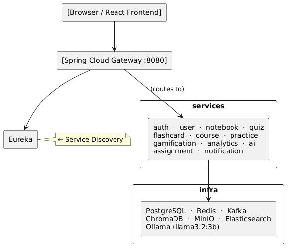

# 📋 Questly — Software Requirements Specification (SRS)

> **Version**: 1.0
> **Author**: Manju (Solo Developer)
> **Date**: 2026-05-22
> **Status**: Draft

---

## Table of Contents

1. [Introduction](#1-introduction)
2. [Overall Description](#2-overall-description)
3. [Functional Requirements](#3-functional-requirements)
4. [Non-Functional Requirements](#4-non-functional-requirements)
5. [System Constraints](#5-system-constraints)
6. [Assumptions](#6-assumptions)
7. [Out-of-Scope (v1)](#7-out-of-scope-v1)

---

## 1. Introduction

### 1.1 Purpose

This Software Requirements Specification (SRS) defines the complete functional and non-functional requirements for **Questly**, an AI-powered student learning platform. It serves as the primary contract between the developer and all stakeholders, and as the ground truth for implementation, testing, and evaluation.

### 1.2 Scope

Questly is a full-stack web application that enables students to:
- Upload study documents and interact with them via a closed-domain RAG-powered AI
- Automatically generate flashcards, quizzes, and summaries from uploaded content
- Enroll in structured courses and track coding practice
- Progress through a visual skill tree
- Stay motivated with XP, badges, and streaks
- Analyse their own learning through an analytics dashboard

The system is built for a **demo/academic environment** with support for up to 100 concurrent students. All AI inference runs locally via Ollama — no external API calls are made for AI features.

### 1.3 Definitions, Acronyms, and Abbreviations

| Term | Definition |
|---|---|
| RAG | Retrieval-Augmented Generation — AI answering from a local document store |
| SM-2 | SuperMemo 2 — spaced repetition scheduling algorithm |
| SRS | Software Requirements Specification |
| NFR | Non-Functional Requirement |
| LLM | Large Language Model (e.g. llama3.2:3b running via Ollama) |
| DAG | Directed Acyclic Graph — used for the skill tree structure |
| JWT | JSON Web Token — used for stateless authentication |
| MCQ | Multiple Choice Question |
| HLD | High-Level Design |
| LLD | Low-Level Design |
| MinIO | S3-compatible local object storage |
| ChromaDB | Vector database used for document embeddings |

### 1.4 References

- `abstract.md` — Project Abstract
- `problem_statement.md` — Problem Statement
- `key_features.md` — Key Features
- `stories.md` — User Stories
- `roles.md` — User Roles & Permissions Matrix
- `tech_stack.md` — Technology Stack
- `infrastructure.md` — Monorepo Structure
- `progress.md` — Agile Progress Tracker

---

## 2. Overall Description

### 2.1 Product Perspective

Questly is a standalone web application with a microservices backend. It does not integrate with any external LMS (Moodle, Canvas, etc.) in v1. It runs entirely on the developer's local machine during development and demo, with all AI processing handled by a locally-running Ollama instance.

### 2.2 User Classes and Characteristics

| Role | Description | Technical Skill |
|---|---|---|
| **STUDENT** | Primary user. Uploads documents, studies, takes quizzes, tracks progress. | Low — assumes no technical knowledge |
| **TUTOR** | Creates and manages courses, assignments, views student analytics. | Medium |
| **ADMIN** | Manages users, roles, platform-wide settings. | High |

### 2.3 Operating Environment

- **Frontend**: Any modern browser (Chrome, Firefox, Edge, Safari)
- **Backend**: Java 21, Spring Boot 3.x, runs on developer's local machine
- **AI**: Ollama running locally; requires ~8–10 GB free RAM for all models
- **Database**: PostgreSQL (local Docker), Redis (local Docker)
- **Storage**: MinIO (local Docker)
- **OS**: Windows 11 / Linux / macOS

### 2.4 Product Functions Summary

| # | Feature | Priority |
|---|---|---|
| F1 | Document Upload & RAG Knowledge Base | 🔴 Must Have |
| F2 | AI Flashcard Generation | 🔴 Must Have |
| F3 | Quiz Me Mode | 🔴 Must Have |
| F4 | Weak Spot Detection | 🔴 Must Have |
| F5 | Summarize & Simplify | 🟡 Should Have |
| F6 | Pre-Built Courses | 🟡 Should Have |
| F7 | Coding Practice Tracker | 🟡 Should Have |
| F8 | Skill Tree | 🟢 Could Have |
| F9 | Gamification (XP, Badges, Streaks) | 🟢 Could Have |
| F10 | Analytics Dashboard | 🟡 Should Have |
| F11 | Assignment System | 🟢 Could Have |

---

## 3. Functional Requirements

### 3.1 Authentication & Authorization (F0)

| ID | Requirement |
|---|---|
| FR-AUTH-01 | The system shall allow users to register with email and password. |
| FR-AUTH-02 | The system shall allow users to log in with email and password and receive a signed RS256 JWT. |
| FR-AUTH-03 | The system shall support Google OAuth2 as a login method. |
| FR-AUTH-04 | The system shall issue a refresh token on login; access tokens expire in 15 minutes. |
| FR-AUTH-05 | The system shall enforce role-based access control (STUDENT, TUTOR, ADMIN) at the API Gateway level. |
| FR-AUTH-06 | The system shall allow users to delete their own account. |
| FR-AUTH-07 | Passwords shall be stored as bcrypt hashes; no plaintext passwords shall exist in any storage layer. |

---

### 3.2 Document Upload & RAG Knowledge Base (F1)

| ID | Requirement |
|---|---|
| FR-DOC-01 | A student shall be able to upload files in PDF, Markdown (.md), and plain text (.txt) formats. |
| FR-DOC-02 | A student shall be able to link a Google Doc or Google Slides file by URL; the system shall fetch and parse the content via Google Drive API. |
| FR-DOC-03 | The system shall enforce a limit of 50 source documents per notebook and 500,000 words per source. |
| FR-DOC-04 | Upon successful upload, the system shall automatically parse (Apache Tika), chunk, and embed (nomic-embed-text) the document without user intervention. |
| FR-DOC-05 | Embeddings shall be stored in ChromaDB in a collection scoped to the notebook. |
| FR-DOC-06 | The student shall be able to query their notebook with a natural language question; the system shall return an answer grounded strictly in the uploaded documents. |
| FR-DOC-07 | Every RAG response shall include a source citation (document name and chunk reference). |
| FR-DOC-08 | The system shall not retrieve information from the open internet when answering notebook queries. |
| FR-DOC-09 | A student shall be able to delete a document from a notebook; the corresponding embeddings shall also be removed from ChromaDB. |

---

### 3.3 AI Flashcard Generation (F2)

| ID | Requirement |
|---|---|
| FR-FLASH-01 | A student shall be able to trigger flashcard generation for a selected notebook. |
| FR-FLASH-02 | The LLM shall generate question–answer pairs from the notebook's chunked content. |
| FR-FLASH-03 | Each flashcard shall have a question side and an answer side. |
| FR-FLASH-04 | Flashcards shall be scheduled using the SM-2 spaced repetition algorithm. |
| FR-FLASH-05 | After reviewing a card, the student shall rate difficulty on a scale of 1–5; the next review date shall update accordingly. |
| FR-FLASH-06 | The system shall surface only cards due for review on the current date in the review session. |
| FR-FLASH-07 | A student shall be able to view all flashcards for a notebook, including future-scheduled ones. |

---

### 3.4 Quiz Me Mode (F3)

| ID | Requirement |
|---|---|
| FR-QUIZ-01 | A student shall be able to generate a quiz from a selected notebook. |
| FR-QUIZ-02 | The generated quiz shall contain a mix of MCQ, fill-in-the-blank, and short-answer questions. |
| FR-QUIZ-03 | The student shall complete the quiz and submit all answers in one session. |
| FR-QUIZ-04 | The system shall display the score immediately after submission. |
| FR-QUIZ-05 | Wrong answers shall be recorded per topic and persisted for weak spot analysis. |
| FR-QUIZ-06 | A student shall be able to view their quiz attempt history with scores and dates. |

---

### 3.5 Weak Spot Detection (F4)

| ID | Requirement |
|---|---|
| FR-WEAK-01 | The system shall flag a topic as a "weak spot" when a student answers 2 or more consecutive questions on that topic incorrectly. |
| FR-WEAK-02 | Weak spot topics shall be automatically included in the next quiz session for the same notebook. |
| FR-WEAK-03 | A student shall be able to view their current weak spot list on the dashboard. |
| FR-WEAK-04 | A weak spot shall be automatically cleared after the student answers 2 consecutive questions on that topic correctly. |

---

### 3.6 Summarize & Simplify (F5)

| ID | Requirement |
|---|---|
| FR-SUM-01 | A student shall be able to request a summary of a selected document or entire notebook. |
| FR-SUM-02 | The LLM shall return a concise summary not exceeding 500 words. |
| FR-SUM-03 | The summary shall use simpler language than the source document. |
| FR-SUM-04 | A student shall be able to copy the summary to clipboard or save it as a note within the notebook. |

---

### 3.7 Pre-Built Courses (F6)

| ID | Requirement |
|---|---|
| FR-COURSE-01 | A student shall be able to browse all available courses. |
| FR-COURSE-02 | A student shall be able to enroll in a course with a single action. |
| FR-COURSE-03 | Course modules shall unlock sequentially — a student may not access module N+1 until module N is marked complete. |
| FR-COURSE-04 | The system shall display a progress percentage for each enrolled course. |
| FR-COURSE-05 | A student shall be able to resume from their last completed module. |
| FR-COURSE-06 | A tutor shall be able to create, edit, and delete their own courses and modules. |
| FR-COURSE-07 | An admin shall be able to delete any course. |
| FR-COURSE-08 | A tutor shall be able to view the list of enrolled students and their progress for courses they own. |

---

### 3.8 Coding Practice Tracker (F7)

| ID | Requirement |
|---|---|
| FR-PRAC-01 | A student shall be able to create named practice lists. |
| FR-PRAC-02 | A student shall be able to add problems to a list by pasting any URL (LeetCode, HackerRank, etc.). |
| FR-PRAC-03 | Each problem shall have a status of Unsolved, Attempted, or Solved. |
| FR-PRAC-04 | A student shall be able to update the status of any problem at any time. |
| FR-PRAC-05 | The dashboard shall display the total solved count and percentage per list. |
| FR-PRAC-06 | A student shall be able to delete a practice list or individual problems. |

---

### 3.9 Skill Tree (F8)

| ID | Requirement |
|---|---|
| FR-SKILL-01 | The system shall display a skill tree as an interactive Directed Acyclic Graph (DAG). |
| FR-SKILL-02 | Each node shall display one of three states: Locked, In-Progress, or Unlocked. |
| FR-SKILL-03 | A node shall only become Unlocked when all prerequisite nodes are in the Unlocked state. |
| FR-SKILL-04 | Completing a quiz or finishing a module on a topic shall mark the corresponding skill node as In-Progress or Unlocked. |
| FR-SKILL-05 | A student shall be able to click a node to see its prerequisites and the actions required to unlock it. |
| FR-SKILL-06 | An admin shall be able to edit the skill tree structure (add/remove nodes and edges). |

---

### 3.10 Gamification — XP, Badges, Streaks (F9)

| ID | Requirement |
|---|---|
| FR-GAME-01 | The system shall award XP to a student for: quiz completion, flashcard review session, course module completion, and coding problem marked Solved. |
| FR-GAME-02 | Badges shall be awarded automatically when predefined conditions are met (e.g. 7-day streak, first quiz, 100 XP). |
| FR-GAME-03 | A daily streak shall increment by 1 for every calendar day in which a student performs at least one learning activity. |
| FR-GAME-04 | A streak shall reset to 0 if a student has no learning activity for more than 24 hours after the previous activity day. |
| FR-GAME-05 | A student shall be able to view their total XP, badge gallery, and a global leaderboard. |
| FR-GAME-06 | A timed quiz battle shall allow two students to compete on the same quiz set simultaneously. |
| FR-GAME-07 | The battle winner (higher score, or faster completion on a tie) shall receive a bonus XP reward. |

---

### 3.11 Analytics Dashboard (F10)

| ID | Requirement |
|---|---|
| FR-ANAL-01 | A student's dashboard shall display: total study time, number of quizzes taken, average quiz score, flashcards reviewed, and problems solved. |
| FR-ANAL-02 | The dashboard shall include a bar chart showing time spent per topic. |
| FR-ANAL-03 | The dashboard shall include a line chart showing quiz score trend over time. |
| FR-ANAL-04 | Weak spots shall be visually highlighted on the dashboard. |
| FR-ANAL-05 | Dashboard data shall update in near real-time (within 5 seconds of an activity event). |
| FR-ANAL-06 | A tutor shall be able to view per-student analytics for students enrolled in their courses. |
| FR-ANAL-07 | An admin shall be able to view platform-wide analytics aggregated across all users. |

---

### 3.12 Assignment System (F11)

| ID | Requirement |
|---|---|
| FR-ASSIGN-01 | A tutor shall be able to create an assignment with a title, description, and grading rubric. |
| FR-ASSIGN-02 | A student shall be able to view all assignments available to them. |
| FR-ASSIGN-03 | A student shall be able to submit a text-based or file-based answer to an assignment. |
| FR-ASSIGN-04 | Upon submission, the system shall trigger AI auto-grading via Kafka event to the AI service. |
| FR-ASSIGN-05 | The AI shall grade the submission against the rubric and return a score and written feedback. |
| FR-ASSIGN-06 | The graded result shall be visible to the student within 30 seconds of submission. |
| FR-ASSIGN-07 | A student shall be able to view their past submissions and grades. |
| FR-ASSIGN-08 | A tutor shall be able to view all submissions for their assignments. |

---

## 4. Non-Functional Requirements

### 4.1 Performance

| ID | Requirement |
|---|---|
| NFR-PERF-01 | RAG query responses shall be returned within **3 seconds** under normal load (≤10 concurrent queries). |
| NFR-PERF-02 | Quiz generation (full set of questions) shall complete within **5 seconds**. |
| NFR-PERF-03 | Flashcard generation for a notebook of up to 10,000 words shall complete within **10 seconds**. |
| NFR-PERF-04 | Document parsing and embedding pipeline shall complete within **60 seconds** for a document up to 500,000 words. |
| NFR-PERF-05 | All non-AI REST API responses shall return within **500 ms** at p95 under expected load. |
| NFR-PERF-06 | Assignment AI grading shall complete within **30 seconds** of submission. |
| NFR-PERF-07 | The frontend initial page load shall complete within **2 seconds** on a local network. |

### 4.2 Availability

| ID | Requirement |
|---|---|
| NFR-AVAIL-01 | The system shall maintain **99% uptime** during active local development sessions. |
| NFR-AVAIL-02 | The system shall maintain **95% uptime** during the final demo presentation. |
| NFR-AVAIL-03 | A service restart shall not result in loss of persisted user data. |
| NFR-AVAIL-04 | The Ollama AI service shall recover automatically if killed and restarted during a session. |

### 4.3 Security

| ID | Requirement |
|---|---|
| NFR-SEC-01 | All authentication tokens shall use **RS256 asymmetric signing** (private key on auth-service, public key on gateway). |
| NFR-SEC-02 | Access tokens shall expire within **15 minutes**; refresh tokens within **7 days**. |
| NFR-SEC-03 | All service-to-service communication shall pass through the **API Gateway**; no service shall be directly externally accessible. |
| NFR-SEC-04 | All inter-service HTTP calls shall validate the JWT before processing any request. |
| NFR-SEC-05 | No plaintext passwords shall be stored; bcrypt with a cost factor ≥ 12 shall be used. |
| NFR-SEC-06 | API endpoints for TUTOR and ADMIN roles shall reject requests from STUDENT tokens with HTTP 403. |
| NFR-SEC-07 | Students shall not be able to access another student's notebooks, flashcards, or quiz results. |
| NFR-SEC-08 | File uploads shall be validated for MIME type and size before storage in MinIO. |

### 4.4 Scalability

| ID | Requirement |
|---|---|
| NFR-SCALE-01 | The system shall support **100 concurrent students** during the demo without degraded performance beyond defined NFR-PERF targets. |
| NFR-SCALE-02 | Each microservice shall be independently deployable and restartable without affecting other services. |
| NFR-SCALE-03 | The Kafka message broker shall decouple producers and consumers so that high event volume does not block synchronous user actions. |
| NFR-SCALE-04 | The system architecture shall allow horizontal scaling of individual services by running multiple instances behind the Gateway using Docker Compose scaling. |

### 4.5 Data Integrity

| ID | Requirement |
|---|---|
| NFR-DATA-01 | Document embedding pipelines shall be **idempotent** — re-uploading the same document shall not create duplicate embeddings. |
| NFR-DATA-02 | XP ledger entries shall be immutable once written; corrections are made via compensating entries only. |
| NFR-DATA-03 | Quiz attempt scores shall be persisted atomically; a failed write shall not record a partial score. |
| NFR-DATA-04 | All database volumes shall be named Docker volumes to survive container restarts without data loss. |
| NFR-DATA-05 | ChromaDB collections shall use stable, content-derived IDs for chunks to support idempotent re-embedding. |

### 4.6 Usability

| ID | Requirement |
|---|---|
| NFR-USE-01 | A new student shall be able to upload a document and receive a quiz without any onboarding or tutorial. |
| NFR-USE-02 | All interactive elements shall provide visible loading indicators during AI-processing operations. |
| NFR-USE-03 | Error messages shall be human-readable and actionable; no raw stack traces shall be shown to the user. |
| NFR-USE-04 | The application shall be fully functional on viewport widths ≥ 1024 px (desktop-first). |
| NFR-USE-05 | Core ARIA labels shall be present on all interactive elements to support basic screen reader navigation. |

### 4.7 Maintainability

| ID | Requirement |
|---|---|
| NFR-MAINT-01 | Each microservice shall expose a `/health` endpoint compatible with Spring Boot Actuator. |
| NFR-MAINT-02 | Distributed traces shall be available in Zipkin for all inter-service requests. |
| NFR-MAINT-03 | Service metrics (CPU, memory, request rate) shall be exported to Prometheus and visualised in Grafana. |
| NFR-MAINT-04 | All services shall use a centralised config server (Spring Cloud Config) — no hardcoded configuration values. |

---

## 5. System Constraints

### 5.1 Hardware Constraints

| Constraint | Detail |
|---|---|
| **RAM** | Developer machine has 16 GB RAM. All services + Ollama must fit within this budget. Ollama with llama3.2:3b uses ~4–5 GB; remaining services must stay under 10–11 GB combined. |
| **GPU** | Intel Arc GPU is not supported by Ollama. All LLM inference runs in CPU mode. This limits throughput — concurrent AI requests will be serialised. |
| **Disk** | MinIO object storage and ChromaDB must be allocated at least 10 GB of local disk. |

### 5.2 Software Constraints

| Constraint | Detail |
|---|---|
| **Java 21** | All backend services must target Java 21 LTS. No preview features. |
| **Spring Boot 3.x** | All services must use Spring Boot 3.x; Spring Boot 2.x APIs are not used. |
| **Ollama** | LLM inference is limited to models available through Ollama. No cloud AI API (OpenAI, Gemini, Anthropic) may be used in any AI feature. |
| **Local-only AI** | No document content, user data, or query text may leave the local machine for AI processing. |
| **Docker Compose** | The entire infrastructure (PostgreSQL, Redis, Kafka, ChromaDB, MinIO, Ollama, Zipkin) must be orchestratable with a single `docker compose up` command. |
| **Monorepo** | All services must reside in a single Git repository under the defined monorepo structure. |
| **Maven Multi-Module** | The build system is Maven. All services share a root parent POM. Gradle is not used. |

### 5.3 Regulatory & Data Constraints

| Constraint | Detail |
|---|---|
| **Data locality** | All student data (documents, quiz results, embeddings) must reside on the local machine. No third-party cloud storage is used in v1. |
| **No PII in AI context** | Student names, emails, or personally identifiable information must not be included in prompts sent to the LLM. |

### 5.4 Time Constraints

| Constraint | Detail |
|---|---|
| **Solo developer** | The entire platform is designed and built by a single developer (Manju). |
| **Demo deadline** | All Must-Have and Should-Have features must be functional by **2026-07-31**. |
| **Phase gate** | Code implementation (Phase 3 onward) does not begin until Phase 1 (Requirements) and Phase 2 (Design) are fully complete. |

---

## 6. Assumptions

| # | Assumption |
|---|---|
| A-01 | The developer's machine will remain the primary and only deployment environment throughout the project lifecycle. |
| A-02 | Ollama is installed, running, and the required models (`llama3.2:3b`, `nomic-embed-text`, `qwen2.5-coder:3b`) are available before any AI feature is tested. |
| A-03 | A stable internet connection is available for Google OAuth2 login and Google Drive API integration, but is **not** required for core AI features. |
| A-04 | The student's uploaded documents are in a supported format (PDF, Markdown, TXT, Google Docs/Slides). The system does not guarantee useful embeddings for scanned PDFs or image-only files. |
| A-05 | All users accessing the system during development and demo are trusted individuals (teammates, evaluators). No adversarial user behaviour is anticipated in v1. |
| A-06 | The SM-2 algorithm is considered sufficient for spaced repetition scheduling in v1 without calibration to individual students. |
| A-07 | Apache Kafka is used for event-driven communication; synchronous REST fallback will be used for non-critical paths during early sprints when Kafka integration is not yet complete. |
| A-08 | ChromaDB data persisted in a named Docker volume is considered reliable storage for embeddings during the development and demo lifecycle. |
| A-09 | The leaderboard in the gamification module is a global ranking across all registered students. There are no privacy concerns around displaying anonymised usernames and XP scores. |
| A-10 | A "day" for streak purposes is defined as the calendar day in the student's local timezone (as reported by the browser). |

---

## 7. Out-of-Scope (v1)

The following features and capabilities are explicitly **not** included in version 1 of Questly. They may be considered for future versions.

### 7.1 User-Facing Features

| # | Out-of-Scope Item | Reason |
|---|---|---|
| OOS-01 | **Mobile application** (iOS / Android) | Desktop-first focus; responsive mobile web is also deferred |
| OOS-02 | **Real-time collaborative notebooks** | Significant complexity; not required for solo study use case |
| OOS-03 | **Video or audio content upload** | Transcription pipeline would require additional models and RAM |
| OOS-04 | **Social/community features** (comments, follow, share) | Out of scope for an academic demo platform |
| OOS-05 | **Marketplace for courses** (payments, revenue split) | No payment integration in v1 |
| OOS-06 | **Live video tutoring or chat** | Real-time communication infra not planned |
| OOS-07 | **Multi-language UI** | English-only in v1 |
| OOS-08 | **Public API or developer SDK** | Not required for the academic capstone scope |

### 7.2 Infrastructure & Operations

| # | Out-of-Scope Item | Reason |
|---|---|---|
| OOS-09 | **Cloud deployment** (AWS, GCP, Azure) | All infrastructure stays local in v1 |
| OOS-10 | **Automated disaster recovery / backups** | Local dev environment; manual Docker volume backup is acceptable |
| OOS-11 | **Multi-region or geo-distributed deployment** | Single-machine setup in v1 |
| OOS-12 | **CDN for static asset delivery** | Local Vite dev server is used |

### 7.3 Integrations

| # | Out-of-Scope Item | Reason |
|---|---|---|
| OOS-14 | **LMS integrations** (Moodle, Canvas, Blackboard) | No external LMS dependency in v1 |
| OOS-15 | **LeetCode API integration** (auto-sync solve status) | No official public API; URL-paste approach is used instead |
| OOS-16 | **Email / SMS notifications** | In-app Kafka-driven notifications only in v1 |
| OOS-17 | **Third-party cloud AI APIs** (OpenAI, Gemini, Claude) | All AI is local via Ollama |
| OOS-18 | **Single Sign-On (SSO) beyond Google OAuth2** | Only Google OAuth2 is supported in v1 |

### 7.4 Data & Compliance

| # | Out-of-Scope Item | Reason |
|---|---|---|
| OOS-19 | **GDPR / FERPA compliance** | Academic demo scope; no real student PII at scale |
| OOS-20 | **Data export / right to erasure (GDPR Article 17)** | Not required for demo; user can delete account |
| OOS-21 | **Audit logging** | Not required for v1 demo |
| OOS-22 | **Penetration testing / third-party security audit** | Not required for academic submission |

---

*Document Version: 1.0 | Last Updated: 2026-05-22 | Author: Manju*
