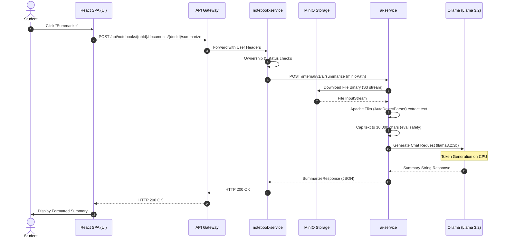

# Questly - AI Architecture & Pipeline Explanation

This document provides a comprehensive technical overview of Questly's local AI features, illustrating the internal data flows, service endpoints, and storage schemas for **AI Document Summarization** and **RAG-powered AI Chat**.

---

## 1. AI Summary & Simplification Pipeline

When a user requests a summary for an uploaded document, the system initiates a synchronous document processing pipeline across `notebook-service`, `ai-service`, and local `Ollama` hosting.

### Pipeline Flow



### Key Architectural Details

1. **Authentication & Multi-Tenancy Validation:**
   In [NotebookService.java](file:///c:/Users/umanj/My%20Drive/Projects/capstone/services/notebook-service/src/main/java/com/questly/notebook/service/NotebookService.java#L134-L168), the system verifies that the requesting `userId` owns the target notebook and document before initiating any third-party calls, securing multi-tenant privacy.
2. **Volatile In-Memory Parsing:**
   The `ai-service` streams the document out of MinIO and uses an in-memory **Apache Tika** parser (`AutoDetectParser`) to extract raw text content dynamically. This ensures that massive file conversions do not block microservice storage or logs.
3. **Structured Prompt Construction:**
   The text content is capped at `10,000` characters to maintain fast prompt evaluation speeds and loaded into a targeted learning prompt:
   ```markdown
   You are Questly, an expert student learning tutor.
   Summarize the following study document in plain, simple language.
   The summary must be highly concise, clear, and easily understandable by a student.
   The maximum length is 500 words. Format with clean paragraphs and bullet points if appropriate.
   
   Document Text:
   {Extracted Content}
   ```

---

## 2. RAG AI Chat & Semantic Search Pipeline

To answer chat questions about uploaded books, Questly implements a high-performance **Retrieval-Augmented Generation (RAG)** pipeline.

### Architectural Component View

```
  ┌─────────────────────────────────────────────────────────────┐
  │                        User Browser                         │
  └──────────────────────────────┬──────────────────────────────┘
                                 │ Query Text
                                 ▼
  ┌─────────────────────────────────────────────────────────────┐
  │                    notebook-service                         │
  └──────────────────────────────┬──────────────────────────────┘
                                 │ Forward Request
                                 ▼
  ┌─────────────────────────────────────────────────────────────┐
  │                        ai-service                           │
  └──────────────┬──────────────────────────────┬───────────────┘
                 │                              │
                 │ 1. Vectorize Query           │ 3. Semantic Similarity Match
                 ▼                              ▼
  ┌──────────────────────────────┐       ┌──────────────────────┐
  │            Ollama            │       │       ChromaDB       │
  │      (nomic-embed-text)      │       │     Vector Index     │
  └──────────────────────────────┘       └──────────────────────┘
                 │                              │
                 │ 2. Return Query Vector       │ 4. Return Top 5 Source Chunks
                 ▼                              ▼
  ┌─────────────────────────────────────────────────────────────┐
  │                        ai-service                           │
  └──────────────────────────────┬──────────────────────────────┘
                                 │
                                 │ 5. Call LLM (llama3.2:3b)
                                 ▼
  ┌─────────────────────────────────────────────────────────────┐
  │                            Ollama                           │
  │                         (llama3.2:3b)                       │
  └──────────────────────────────┬──────────────────────────────┘
                                 │
                                 ▼ Generated Answer
  ┌─────────────────────────────────────────────────────────────┐
  │             Formatted Response with Citations               │
  └─────────────────────────────────────────────────────────────┘
```

### Detailed RAG Lifecycle

#### Phase A: Ingestion & Vector Encoding (On Upload)
* When a PDF/document is processed, `ai-service` splits it into semantic chunks.
* Each chunk is passed to the **`nomic-embed-text`** model inside Ollama, creating vector embeddings representing the semantic meaning of that chunk.
* These embeddings are saved inside a notebook-isolated collection in **ChromaDB** (`notebook_{notebookId}`).

#### Phase B: Semantic Retrieval (During Query)
* When a student asks a question (*"What is inheritance?"*), `ai-service` embeds the question text.
* It searches the ChromaDB vector space using a **cosine similarity algorithm**, returning the top 5 most semantically aligned source segments in the book.

#### Phase C: Context Augmentation & Generation
* The top 5 text segments are formatted as source contexts and injected directly into the chat prompt template:
  > [!IMPORTANT]
  > **RAG Prompt Template:**
  > ```
  > You are Questly, an expert student learning tutor.
  > Answer the student's question based strictly on the source documents provided below.
  > If the answer cannot be found in the provided sources, state exactly:
  > "I cannot find the answer in your uploaded documents."
  > Do not make up facts.
  > 
  > ---
  > SOURCE CHUNKS:
  > [Source 1] {Semantic Chunk A}
  > [Source 2] {Semantic Chunk B}
  > ...
  > 
  > ---
  > STUDENT QUESTION:
  > What is inheritance?
  > ```
* This ensures that `llama3.2:3b` operates strictly in an **"open-book"** style, drastically reducing factual hallucinations and grounding answers directly in the student's study material.

---

## 3. Performance & Timeout Optimization

When running large language models locally on typical developer setups, CPU-only execution can introduce high latencies during the model load and prompt evaluation stages.

### Optimization Parameters

| Parameter | Original Value | Optimized Value | Technical Rationale |
| :--- | :--- | :--- | :--- |
| **Ollama Chat Timeout** | `60 seconds` | `300 seconds` (5m) | Allows the local CPU execution enough headroom to load model weights and generate tokens without throwing socket disconnects. |
| **Max Text Safety Cap** | `20,000` chars | `10,000` chars | Cuts prompt processing and context evaluation time on CPU in half while retaining more than enough text context for high-quality summaries. |
| **Model Pre-warming** | Dynamic | Cached in RAM | Once loaded by Ollama, subsequent request latencies fall dramatically because model weights remain warm in memory. |
